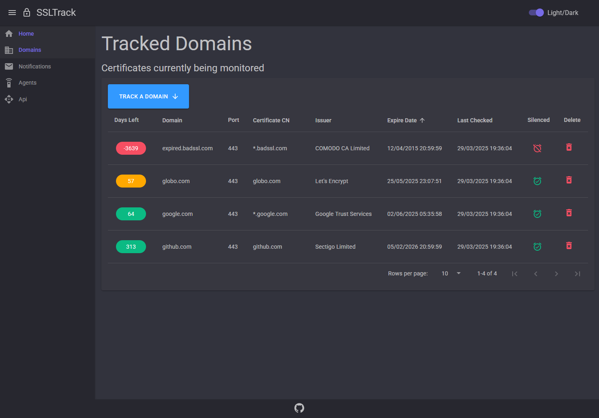

# :lock: SSL Track

Ensure the continued security and reliability of your website by staying vigilant about SSL certificate expiration.

---

### Pre built container

>https://hub.docker.com/r/zimbres/ssltrack

---

# :warning: Warning

The background jobs responsible for expiration verification and email alerts will not start when the application is restarted unless there is some activity on the Web UI.
This can be avoided either by configuring a monitoring tool to call the health API endpoint or by following the HangFire team's recommendations.

- [HangFire Docs](https://docs.hangfire.io/en/latest/deployment-to-production/making-aspnet-app-always-running.html)
- Api Health Check Endpoint: https://my.server.com/api/health

---

---

A pre-compiled package is available for Windows and Linux. It requires ASP.NET Core Runtime 10.x.

[Download .NET 10.0](https://dotnet.microsoft.com/en-us/download/dotnet/10.0)