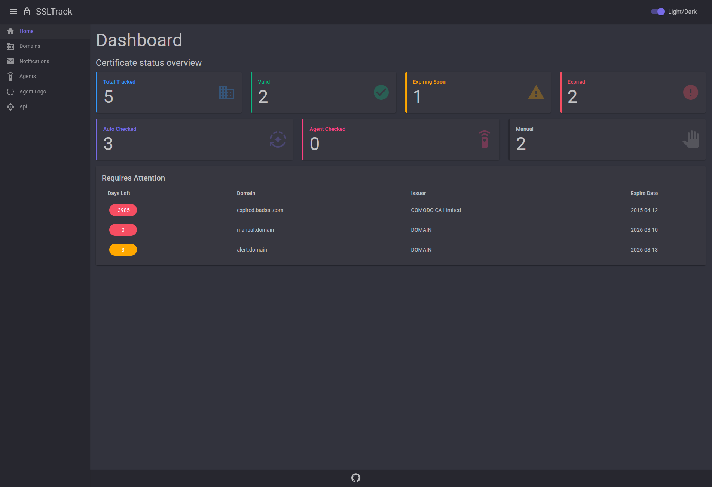
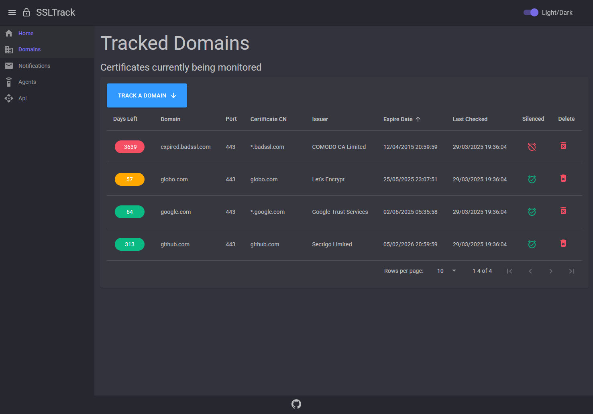

# SSLTrack

Monitor SSL/TLS certificate expiration across multiple domains and receive email alerts before they expire. SSLTrack uses a distributed architecture with remote agents that can check certificates from different network locations.





---

## Features

- **Certificate monitoring** — track expiry dates, issuer, and common name for any domain
- **Distributed agents** — deploy lightweight agents in different networks to check certificates from multiple vantage points
- **Email alerts** — automated SMTP notifications when certificates approach expiration (configurable threshold)
- **Blazor web UI** — manage domains, agents, and settings from a browser
- **REST API** — full API with Swagger/OpenAPI documentation
- **Background scheduling** — Hangfire-powered recurring jobs for checks, alerts, and log cleanup
- **Docker ready** — pre-built images on Docker Hub, Docker Compose included

---

## Quick Start (Docker Compose)

The fastest way to run SSLTrack with a bundled SMTP test server:

```bash
git clone https://github.com/zimbres/SSLTrack.git
cd SSLTrack

# Edit the two config files before starting
# appsettings.ssltrack.json  — main app config
# appsettings.agent.json     — agent config

docker compose up -d
```

| Service | URL |
|---|---|
| SSLTrack web UI | http://localhost:8080 |
| SMTP4Dev (test mail) | http://localhost:8025 |

---

## Pre-built Container

```bash
docker pull zimbres/ssltrack
```

> Docker Hub: https://hub.docker.com/r/zimbres/ssltrack

---

## Manual Installation

A pre-compiled binary is available for Windows and Linux. Requires the ASP.NET Core Runtime 10.x.

- [Download .NET 10.0 Runtime](https://dotnet.microsoft.com/en-us/download/dotnet/10.0)
- Download the latest release from the [Releases page](../../releases)

```bash
# Linux (example)
./SSLTrack
```

---

## Configuration

### Main Application (`appsettings.ssltrack.json`)

```json
{
  "ConnectionStrings": {
    "Data": "Data Source=./data/data.db"
  },
  "Configurations": {
    "DaysToExpiration": 30,
    "AlertsEnabled": true,
    "UpdateCron": "*/5 * * * *",
    "AlertCron": "*/5 * * * *",
    "ClearLogsCron": "*/5 * * * *"
  },
  "MailProperties": {
    "Name": "Domain Monitor",
    "MailFrom": "domain@domain.com",
    "MailTo": "alerts@domain.com",
    "Bcc": "",
    "Subject": "",
    "Body": "",
    "IsBodyHtml": true,
    "Username": "",
    "Password": "",
    "SmtpHost": "smtp-ssltrack",
    "Port": 25,
    "EnableSsl": false
  }
}
```

| Key | Description |
|---|---|
| `DaysToExpiration` | Days before expiry to start alerting |
| `AlertsEnabled` | Enable or disable email alerts |
| `UpdateCron` | Cron schedule for certificate checks |
| `AlertCron` | Cron schedule for sending alert emails |
| `ClearLogsCron` | Cron schedule for clearing old logs |

### Agent (`appsettings.agent.json`)

```json
{
  "Configurations": {
    "Delay": 5,
    "SSLTrackApiAddress": "http://app:8080",
    "AgentId": 2,
    "AuthType": "",
    "GrantType": "client_credentials",
    "ClientId": "ID",
    "Username": "ssltrack_agents",
    "Password": "ssltrack_agents",
    "AuthUrl": "https://auth/application/o/token/"
  },
  "HttpClientConfiguration": {
    "UseProxy": false,
    "IgnoreSsl": true
  }
}
```

| Key | Description |
|---|---|
| `Delay` | Seconds between certificate check cycles |
| `SSLTrackApiAddress` | URL of the main SSLTrack server |
| `AgentId` | Unique numeric ID for this agent (must match an agent record in the UI) |
| `AuthType` | Leave empty for no auth, `Basic` or `OAuth2` |
| `IgnoreSsl` | Skip TLS validation for the connection to the main server |

---

## Architecture

```
┌──────────────────────────────┐
│       SSLTrack Web App       │  Blazor UI + REST API + Hangfire scheduler
│ SQLite · EF Core · MudBlazor │
└──────────────┬───────────────┘
               │ HTTP (REST)
     ┌─────────┴──────────┐
     │                    │
┌────┴─────┐         ┌────┴─────┐
│  Agent 1 │   ...   │  Agent N │  .NET Worker services
│ (local)  │         │ (remote) │  Poll domains, check certs, report back
└──────────┘         └──────────┘
```

- The **main application** stores domains and agents in SQLite, runs scheduled jobs, and serves the UI and API.
- Each **agent** is a lightweight background worker. It fetches its assigned domains from the main app, connects to each domain to retrieve the SSL certificate, and posts the results back.
- Agents can authenticate with the main API using **no auth**, **HTTP Basic**, or **OAuth2 client credentials**. Requires Web App deployed behind a reverse proxy with authentication capabilities. Example: "traefik basic auth", "Authentik", "Keycloak", etc.

---

## API Reference

Interactive documentation is available at `/api/swagger` when the application is running.

| Method | Endpoint | Description |
|---|---|---|
| `GET` | `/api/domains` | List all domains |
| `GET` | `/api/domains/agents/{agentId}` | Domains assigned to an agent |
| `POST` | `/api/domains` | Add a domain |
| `PUT` | `/api/domains/{domainName}` | Update domain certificate data |
| `DELETE` | `/api/domains/{domainId}` | Remove a domain |
| `GET` | `/api/health` | Health check |
| `HEAD` | `/api/ping/{agentId}` | Agent heartbeat |
| `GET` | `/api/logs` | Retrieve logs |
| `POST` | `/api/logs/clear` | Clear all logs |

Hangfire dashboard: `/hangfire`

---

## Warning — Background Jobs

> Background jobs (certificate checks and email alerts) will not start automatically when the application restarts unless there is activity on the web UI or API.

To keep jobs running reliably, configure an external uptime monitor to call the health endpoint periodically:

```
GET https://your-server/api/health
```

Or follow the [Hangfire production deployment guide](https://docs.hangfire.io/en/latest/deployment-to-production/making-aspnet-app-always-running.html).

---

## Development

### Requirements

- [.NET 10 SDK](https://dotnet.microsoft.com/en-us/download/dotnet/10.0)
- Docker (optional, for Docker Compose)

### Run locally

```bash
# Main application (http://localhost:5096)
cd src/SSLTrack
dotnet run

# Agent — in a separate terminal
cd src/SSLTrackAgent
dotnet run
```

### Run with .NET Aspire

```bash
cd src/SSLTrack.AppHost
dotnet run
```

---

## License

[GNU Affero General Public License v3](LICENSE)
